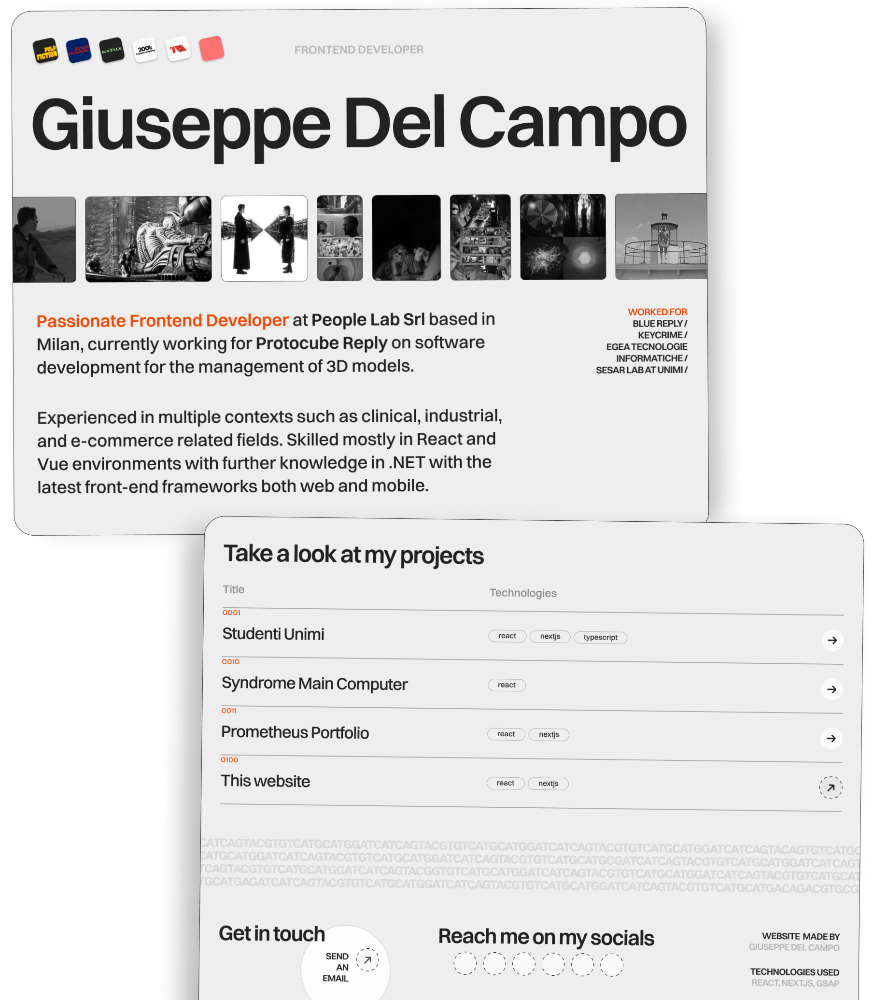

# Prometheus Portfolio
[](https://lbesson.mit-license.org/)
[](https://github.com/Giuseppetm/pulpfolio/issues/)
[](https://app.netlify.com/sites/giuseppedelcampo/deploys)

Personal portfolio created with React and NextJS, designed with Figma. 🎦 [LIVE PREVIEW](https://giuseppedelcampo.netlify.app/)



## 🕹️ How to run the project locally

1. Install dependencies
   ```sh
   npm install
   ```

2. Run the development server:

   ```sh
   npm run dev
   ```

For deploys I am currently using [Netlify](https://app.netlify.com/).
